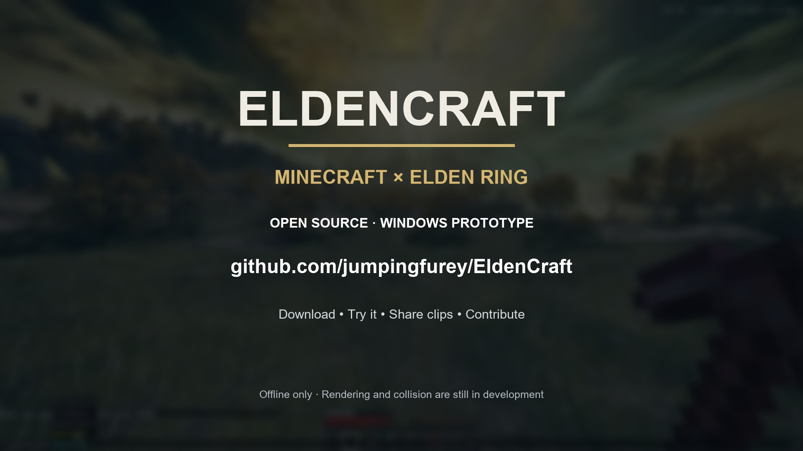

# EldenCraft — experimental Windows prototype

Run Minecraft Java 1.21.1 alongside Elden Ring, with bridged movement, floor sampling, combat and block building.

**[Download the Windows prototype](https://github.com/jumpingfurey/EldenCraft/releases/tag/v0.1.0)** · [Setup guide](docs/PLAY.md) · [Report a bug](https://github.com/jumpingfurey/EldenCraft/issues) · [Contribute](CONTRIBUTING.md)

**This is an unfinished prototype.** Minecraft currently draws in a transparent window over Elden Ring. Windows DirectX 12 composition, depth occlusion and host lighting are not implemented: blocks can show through the map, and camera alignment can drift or bounce. Ground collision is approximate; proper wall collision is unfinished.

Adapted from [justbustin's Minecraft crossover bridge](https://github.com/justbustin/minecraft-crossover-bridge). [SkyCraft](https://github.com/chasmlol/SkyCraft) inspired the request, but its Skyrim plugin is not used as the Elden Ring host.

## Watch the showcase

[Watch/download the 51-second showcase](https://github.com/jumpingfurey/EldenCraft/releases/download/v0.1.0/EldenCraft-Showcase-1080p.mp4) — 1080p, 60 FPS. Recorded prototype gameplay, edited from two clips supplied by the project owner.

## Requirements

- Windows x64; owned copies of Elden Ring and Minecraft: Java Edition.
- Elden Ring App 1.17.1 / executable **2.7.1.0**. Other versions are refused.
- Minecraft **1.21.1**, Fabric Loader **0.19.5**, Fabric API **0.116.17+1.21.1**.
- Offline Elden Ring launch through Mod Engine 3; a separate mod save is used.

## Play

Download `EldenCraft-Windows-Prototype-0.1.0.zip` from [the release page](https://github.com/jumpingfurey/EldenCraft/releases/tag/v0.1.0), extract it, then follow [the player setup guide](docs/PLAY.md). Source checkouts need building and packaging first; the launcher alone does not contain the mod binaries.

The portable launcher starts Elden Ring. Start the dedicated Fabric profile yourself in the official Minecraft Launcher, signed into your own account. Automatic Minecraft startup in the original development workspace is not part of this portable player workflow.

| Control | Action |
| --- | --- |
| WASD / mouse / Space | Minecraft movement and building |
| E | Minecraft inventory |
| R | Elden Ring interaction |
| F8 | Switch control between Minecraft and Elden Ring |

Survival enables hearts, hunger and ordinary damage; Minecraft commands can enable Creative. TNT can damage Minecraft blocks and published Elden Ring enemies; it cannot excavate Elden Ring's map.

The configured frame limit is 300 FPS. Actual performance depends on hardware and scene; measured development gameplay was roughly 77–110 FPS, not sustained 300 FPS. Enemy coverage is limited to 256 loaded characters within 80 metres.

## Develop

See [BUILD.md](docs/BUILD.md), [architecture](docs/ARCHITECTURE.md), and [validation](docs/VALIDATION.md).

- `er-bridge/`: C++ loader, game hooks, shared-memory protocol, native tests.
- `mc-bridge/`: Fabric Minecraft mod, Gradle wrapper and source.
- `launcher/`: portable offline launcher templates.
- `Build-Package.ps1`: assemble a clean distributable from built artifacts.

No game assets, Minecraft distributions, personal worlds, saves, login tokens or logs are supplied. Do not upload a used game directory.

## License and credits

MIT; preserve the upstream copyright notice in [LICENSE](LICENSE). Other dependencies retain their own licenses. See [third-party notices](THIRD-PARTY-NOTICES.md).

Project owner: [jumpingfurey](https://github.com/jumpingfurey). Development, documentation, packaging and showcase editing received **OpenAI Codex AI assistance**. See [contributors](CONTRIBUTORS.md) for credits.

This is an independent fan project, not affiliated with Mojang, Microsoft, FromSoftware or Bandai Namco.

## Help the project grow

Try the prototype, share clips of what works and what needs improving, and link back to this repository. Bug reports with reproduction steps and pull requests are welcome. Developers interested in DirectX 12 rendering, depth occlusion or collision can start with [the architecture notes](docs/ARCHITECTURE.md).
